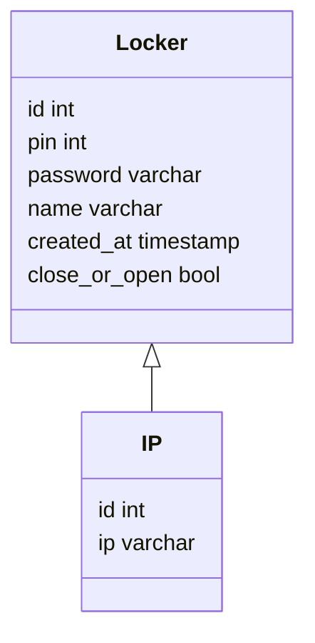

# 1. Langages utilisés

<div>
	<ul>Python</ul>
	<ul>Json</ul>
	<ul>PHP</ul>
	<ul>MySQL</ul>
	<ul>CSS</ul>
	<ul>Javascript</ul>
</div>

# 2.Front

## 2.1 Interface utilisateur

L'interface utilisateur de ce locker a été conçue pour être simple et intuitive, avec une interface utilisateur moderne et un design élégant. Les différents éléments qui composent cette interface sont présentés ci-dessous :

- Un titre de page : Locker Project
- Un formulaire de saisie du mot de passe : Le formulaire (avec pavé numérique) permet aux utilisateurs de saisir leur mot de passe pour accéder au locker.
- Un bouton pour envoyer le mot de passe : Le bouton permet aux utilisateurs de valider leur saisie du mot de passe.

## 2.2 Fonctionnement et évènements Javascript

Le pavé numérique fonctionne avec une boucle qui possède comme paramètre le bouton qui a été cliqué. Le bouton est stocké dans une variable `buttonValue` qui est ensuite comparé à la valeur de `0` pour déterminer si le bouton a été cliqué ou non. Si le bouton a été cliqué, le mot de passe est ajouté à une liste `data` et le mot de passe est réinitialisé avec la liste. Cette liste `data` est ensuite convertie en chaîne de caractères avec la fonction `join("")` et assignée à la valeur du mot de passe.

Le bouton d'envoi du mot de passe fonctionne de la même manière que le pavé numérique. Il vérifie si le mot de passe est correct ou non en comparant le mot de passe à la valeur de `right_password` qui représente le mot de passe correct stocké dans la BDD. Si le mot de passe est correct, le message "Le code est correct ! Veuillez récupérer votre colis." est affiché. Si le mot de passe est incorrect, le message "Le code est incorrect ! Veuillez réessayer." est affiché.

La checkbox qui permet de masquer le mot de passe fonctionne en utilisant la fonction `hidePassword()` qui change la valeur du type du mot de passe en fonction de la valeur de l'attribut `type`. Si le type du mot de passe est "text", il est changé en "password". Sinon, le type du mot de passe est changé en "text".

## 2.3 Envoi de la requête

La requête est envoyée avec la fonction `send()` de la requête XMLHttpRequest. Elle est définie avec les paramètres suivants :

- La méthode `open()` est utilisée pour définir la méthode HTTP à utiliser pour l'envoi de la requête. Dans notre cas, la méthode est "POST".
- La méthode `setRequestHeader()` est utilisée pour définir les en-têtes HTTP à utiliser pour l'envoi de la requête. Dans ce cas, les en-têtes sont "Content-Type" et "application/json; charset=UTF-8".
- La méthode `send()` est utilisée pour envoyer la requête. Dans ce cas, la requête est envoyée avec le corps JSON.

Le corps JSON est défini avec la fonction `JSON.stringify()` qui convertit le corps JSON en une chaîne de caractères. Le corps JSON est défini avec les paramètres suivants :

- `id` : L'identifiant de la requête est défini avec la valeur de l'`id` correspondant à la requête, soit un entier.
- `password` : Le mot de passe est défini avec `password.value` qui représente le mot de passe saisi par l'utilisateur.
- `name` : Le nom du locker est défini avec la valeur `name` (ex: "locker1").
- `status` : Le statut de la requête est défini par un booléen qui représente si le locker est ouvert ou fermé (ex: false).
- `created_at` : La date de création de la requête est définie avec la valeur de la date actuelle.

La fonction `send()` est appelée avec le corps JSON comme paramètre.

## 2.4 Récupération de la réponse

La réponse de la requête est récupérée avec la fonction `onload()` de la requête XMLHttpRequest. Elle est définie avec les paramètres suivants :

- La méthode `onload()` est utilisée pour définir la fonction qui sera exécutée lorsque la requête est récupérée.
- La méthode `readyState` est utilisée pour définir si la requête est récupérée ou non.
- La méthode `status` est utilisée pour définir si la requête a été réussie ou non.
- La méthode `responseText` est utilisée pour définir le corps de la réponse.

La fonction `onload()` est appelée avec le corps JSON comme paramètre.

## 2.5 waiting for the bozos for the 'door close or open' data

# 3.Back

## 3.1 Base de données

L'idée du locker amène à la création d'une base de données. Nous en sommes arrivés à la conclusion qu'il était nécessaire d'obtenir toutes les informations du locker comme les identifiants ou les mots de passe.



Notre base de données ne contient qu'une seule table 'Locker' qui est la base même de notre API. Celle-ci vient reprendre toutes les informations nécessaires pour récupérer et renvoyer les informations au front.<br>
Pour lancer les fichiers liés à la base de données il faut exécuter dans le terminal de commande :
php nomDuFichier

## 3.1 Index

On vient chercher les données de la base de données. <br>
Avec le $\_GET['password'] on récupère le mot de passe pour venir le comparer à la base de données et ainsi vérifier s'il y a une donnée qui coïncide.<br>
La fonction htmlentities vient sécuriser la requête en empêchant les failles de sécurité HTML en bloquant toutes les balises HTML qui pourraient être rentrées dans le champ de mot de passe.<br>
Le query et le fetch_assoc viennent comparer les données contenues en base de données afin de pouvoir ouvrir le locker ou afficher un message d'erreur indiquant que le mot de passe n'est pas correct.<br>
Le tout est situé dans un try catch, instruction définissant un message si une des instructions contenues à l'intérieur provoque une exception à la sortie. Le try catch sert à attraper les erreurs et à les afficher en cas de problème.<br>

## 3.2 Statut (Ouvert ou Fermé)

On vient lier notre back-end au code en python afin de vérifier que l'id récupéré du python existe bien en base de données. <br>
Une fois l'id vérifié, si celui-ci existe en base de données alors le statut est modifié (le booléen change) pour passer du statut fermé à ouvert<br>
A la fin, on vient vérifier que le statut est repassé à fermer et auquel cas le locker se ferme et on vient exécuter le morceau de code de génération de mot de passe.<br>

## 3.3 Générateur de mot de passe

Une fois que le locker est refermé, on vient lancer l'exécution d'un code de génération de mot de passe.<br>
Le code fait en sorte de venir créer un code à 4 chiffres situé entre 1000 et 9999. Une fois le code trouvé il est passé en base de données afin de vérifier que ce numéro n'existe pas déjà là-bas. Si le mot de passe se trouve déjà en base de données alors le code est exécuté de nouveau sinon, le mot de passe est hashé puis envoyé en base de données.<br>

# 4.Script de contrôleur de moteur en Python, sur Rasberry PI + Script d'exécution en php.

### Mise en place du projet


Pour commencer à faire tourner le loquet, il faut déjà le brancher correctement. Un cerveau moteur doit être branché de la manière suivante :

- Le fil "moins" sur un pin **ground**
- Le fil "plus" sur un pin d'alimentation **5V**
- Le fil "signal" sur un pin **GPIO**

:warning: Le Raspberry doit être redémarré après les branchements !

<br/>

### Script de mise en marche du cerveau moteur

Le fichier est dans le chemin suivant : _/var/www/html/locker_
<br/>

```python
import sys
import time
from gpiozero import Servo, RGBLED
from time import sleep
```

Nous avons besoin d'importer plusieurs librairies Python.
`Time` sert à utiliser des valeurs en secondes.
`Sys` permet d'appeler le script depuis le terminal avec des paramètres donnés.
`Gpiozero` est un outil pour manipuler les GPIO.
`Servo` est utilisé pour gérer la rotation d'un cerveau moteur. La rotation peut être effectué du minimum au maximum en passant par le point médian.
`RGBLED` est la classe qui permet de manipuler une led multicolore avec les pin GPIO
<br/>

```python
led = RGBLED(red=16, green=20, blue=21)
commande = sys.argv[1] # ouvrir ou fermé
myGPIO = sys.argv[2]   #Le nom de la pin GPIO
servo = Servo(myGPIO) #
```

Les variables `17` et `27` correspondent aux numéros des ports GPIO utilisés pour les cerveaux moteurs.
`myGPIO` et `commande` sont les variables qui stockent des données récupérées depuis l'API via l'url.
<br/>

```python
def closeLocker():
	servo.max()
	led.color =(0.5, 0, 0)
	time.sleep(0.5)
	print('success')
	print('closed')

def openLocker():
	servo.min()
	led.color =(0, 0.5, 0)
	time.sleep(0.5)
	print('success')
	print('opened')
```

Voici les deux fonctions qui servent à **ouvrir** et **fermer** le loquet.
:warning: Le loquet doit être qualibré manuellement afin que le `min` ou le `max` correspondent à la position **ouverte** ou **fermer**
Avec la fermeture, une led RGB est activée afin de donner des informations visuelles à l'utilisateur
<br/>

```python
if len(sys.argv) > 1 :
	if (myGPIO == '17') or (myGPIO == '27') :
		if commande == '2':
			openLocker()
			isopen = True
		elif commande == '1':
			closeLocker()
			isopen = False
		else:
			print('error')
			print("l'instruction n'est pas bonne")
			clignoter() #informe l'utilisateur d'un problème
	else:
		print('error')
		print("le pin n'est pas bon")
		clignoter() #informe l'utilisateur d'un problème
```

Maintenant on vérifie que les ports GPIO correspondent bien à un loquet existant puis on change l'état de **fermer** à **ouvert** ou de **ouvert** à **fermer**

<br/>

### Script PHP de lancement du script Python

<br/>

Afin de communiquer avec l'API, on a crée un fichier `index.php`. Ce fichier permet d'exécuter le script de controle du moteur, sans passer par le terminal.

Dans un premier temps, on initialise les variables.

```php
$output = null; //output original value
$result = null; //output original result
```

 <br/>

Ensuite, le programme récupère les paramètres dans la requête API et vérifie leur présence.

```php
if(isset($_GET['command']) && !empty($_GET['command'])){
	$command = $_GET['command'];
}else{
	$output[0]="error";
	$output[1] = "command is missing or wrong";
}

if(isset($_GET['port']) && !empty($_GET['port'])){
	$port = $_GET['port'];
}else{
	$output[0]="error";
	$output[1] ="port is missing or wrong";
}

```

<br/>

Le programme exécute le script python avec les paramètres. Il renvoit aussi une réponse `json` qui contient les print du script python.

```php
exec("python3 script.py $command $port ", $output);

echo json_encode($output);//réponse json
```

# 5.Serveur

Le serveur est accessible grâce à un Linux Ubuntu sur lequel nous avons installé un serveur apache ainsi que PHP en version 8.1 et une version de MySQL afin de pouvoir faire tourner notre API dessus.
